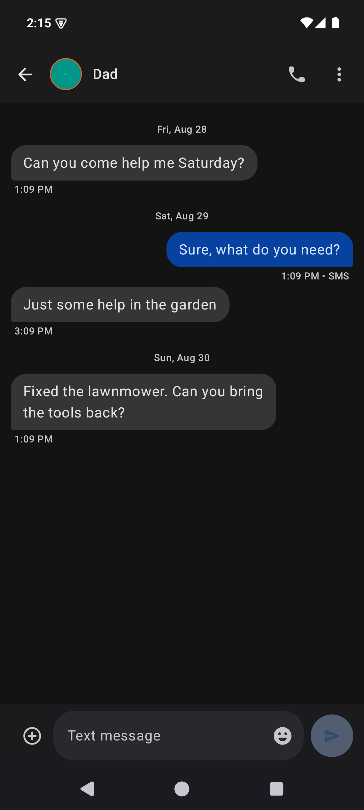
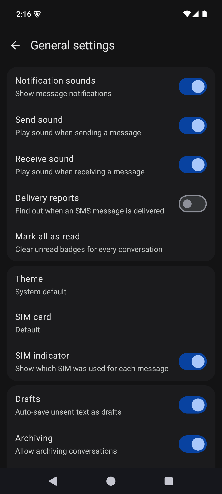
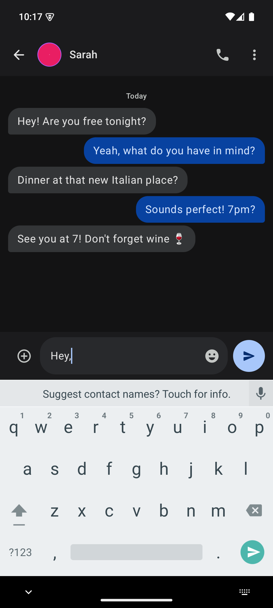
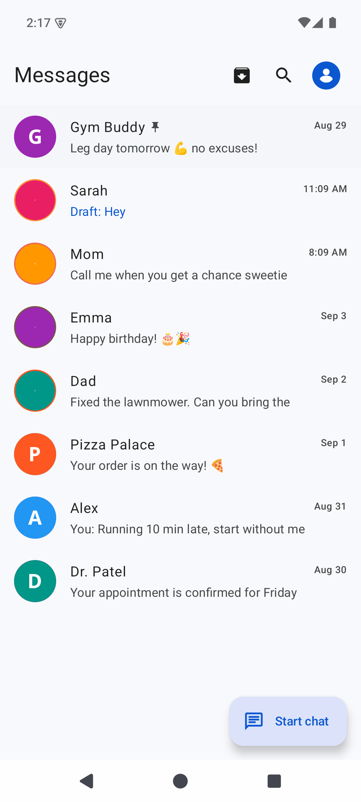
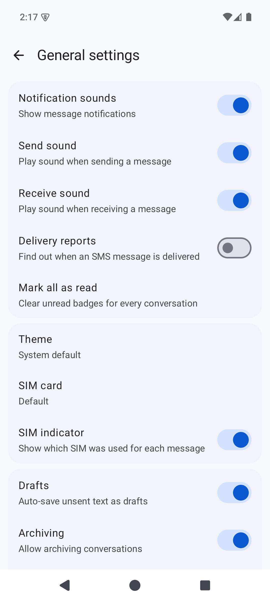

# Messages

Simple, private SMS messaging. Offline-first, no ads, no tracking.

Built with **Kotlin + Jetpack Compose + Material 3 (M3)**. No internet permission — everything is local SMS + local database.

## ⚠️ Keep Android Open — Important

> **Unless you oppose it, Google will lock down Android in 2027** — silencing independent
> developers, F-Droid, and open-source distribution worldwide, with no opt-out [keepandroidopen.org](https://keepandroidopen.org).

## Features

- **Real SMS + MMS**: Send/receive SMS with multi-SIM support; imports and displays MMS (text + photos) from the system provider
- **Google Messages UI**: Material 3 design, dark/light themes, conversation avatars, animated message bubbles
- **Backup & Restore**: PIN-encrypted backup/restore with a chosen save location (including external SD cards)
- **Message Management**: Pin, archive, delete, block numbers, trash with 30-day auto-purge
- **Drafts**: Auto-save drafts, restore on conversation open
- **Scheduled Messages**: Long-press send to schedule messages with DatePicker + TimePicker
- **Quick Reply**: Reply directly from notifications
- **Message Lock**: Biometric-protect sensitive messages
- **OTP Highlighting**: One-time passwords automatically highlighted in blue
- **Contact Photos**: Loads real contact profile pictures
- **Delayed Sending**: Configurable delay before sending messages
- **Work Profile Contacts**: Search contacts in both the personal and work (managed) profile; work contacts are shown with a briefcase badge in the picker, home list, and chat header
- **Accessibility Mode**: TalkBack descriptions, high-contrast themes, larger text and touch targets, and reduced motion

## Screenshots

| Home (Dark) | Chat (Dark) | Settings (Dark) | Reply (Dark) |
|---|---|---|---|
|  |  |  |  |

| Home (Light) | Chat (Light) | Settings (Light) | Reply (Light) |
|---|---|---|---|
|  |  |  |  |

## Download

### GitHub Releases

Download the latest APK directly from [GitHub Releases](https://github.com/an1ndra/Messages/releases/latest) — no store account needed. Every release is scanned with VirusTotal (report posted on the release page).

### F-Droid

F-Droid builds the app from source and signs it with the F-Droid project key.

## Requirements

- Android 10 (API 29) or higher
- SMS/MMS permissions (send, receive, read, MMS/WAP push)
- Contact permission (READ_CONTACTS)
- Notification permission (Android 13+), phone state (dual-SIM), and photo access (attachments)
- No internet permission

## Technical Details

- **Package**: `com.anindra.messages`
- **Min SDK**: 29 (Android 10)
- **Compile / Target SDK**: 36 (Android 16)
- **Database**: SQLite with Flow-based reactive queries
- **Architecture**: Single-Activity, manual `navRoute` state (no Navigation-Compose)

## License

This project is licensed under the GNU General Public License v3.0 - see the [LICENSE](LICENSE) file for details.

## Contributing

See [docs/Developer.md](docs/Developer.md) for development setup instructions.
