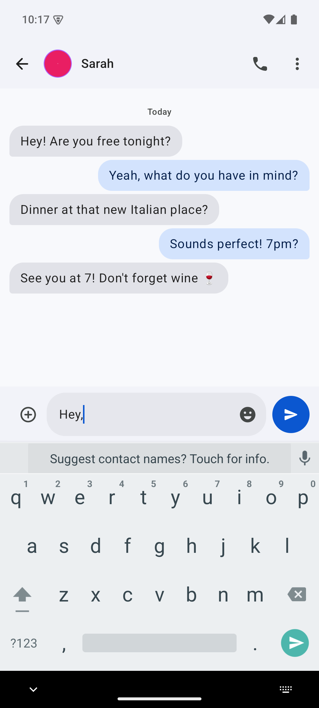

# Messages

An offline SMS messaging app for Android that clones the UI of Google Messages.

Built with **Kotlin + Jetpack Compose + Material 3 (M3)**. No internet permission — everything is local SMS + local database.

## ⚠️ Keep Android Open — Important

> **Unless you oppose it, Google will lock down Android in 2027** — silencing independent
> developers, F-Droid, and open-source distribution worldwide, with no opt-out.

Starting in 2027, Google will require every Android app developer to register centrally,
agree to their terms, pay a fee, and surrender government-issued ID before their apps can
be installed on any certified Android device — worldwide, with no opt-out. This affects
**all** apps, not just Play Store apps: it threatens independent developers, F-Droid,
open-source distribution, and user autonomy.

This app is distributed openly via **GitHub Releases** and **F-Droid** so you always have a
choice about how you install your software. If you care about keeping Android open, speak
up and join the effort at **[keepandroidopen.org](https://keepandroidopen.org)**.

The "advanced flow" Google offers to sideload unverified apps is a nine-step deterrent
(developer mode, 24-hour wait, repeated scare screens) that runs through Google Play
Services — not the Android OS — and can be tightened or revoked at any time.

## Features

- **Real SMS**: Send/receive SMS messages, multi-SIM support
- **Google Messages UI**: Material 3 design, dark/light themes, conversation avatars
- **Message Management**: Pin, archive, delete, block numbers, trash with 30-day auto-purge
- **Drafts**: Auto-save drafts, restore on conversation open
- **Scheduled Messages**: Long-press send to schedule messages with DatePicker + TimePicker
- **Quick Reply**: Reply directly from notifications
- **Message Lock**: Biometric-protect sensitive messages
- **OTP Highlighting**: One-time passwords automatically highlighted in blue
- **Contact Photos**: Loads real contact profile pictures
- **Delayed Sending**: Configurable delay before sending messages

## Screenshots

| Home (Dark) | Chat (Dark) | Settings (Dark) | Reply (Dark) |
|---|---|---|---|
|  |  |  |  |

| Home (Light) | Chat (Light) | Settings (Light) | Reply (Light) |
|---|---|---|---|
|  |  |  |  |

## Download

### GitHub Releases

Download the latest APK directly from [GitHub Releases](https://github.com/an1ndra/Messages/releases/latest) — no store account needed. Every release is scanned with VirusTotal (report posted on the release page).

### F-Droid (Coming soon)
<!---->

F-Droid builds the app from source and signs it with the F-Droid project key.

## Requirements

- Android 10 (API 29) or higher
- SMS permissions (SEND_SMS, RECEIVE_SMS, READ_SMS)
- Contact permissions (READ_CONTACTS)

## Technical Details

- **Package**: `com.anindra.messages`
- **Min SDK**: 29 (Android 10)
- **Target SDK**: 35 (Android 15)
- **Database**: SQLite with Flow-based reactive queries
- **Architecture**: Single-Activity, Compose Navigation

## License

This project is licensed under the GNU General Public License v3.0 - see the [LICENSE](LICENSE) file for details.

## Contributing

See [Developer.md](Developer.md) for development setup instructions.
