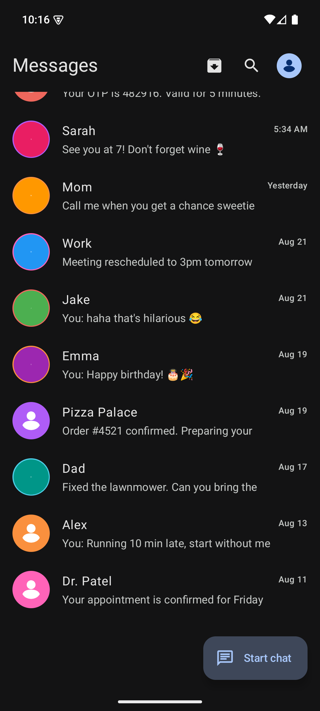
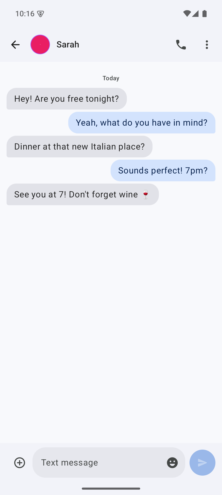

# Messages

An offline SMS messaging app for Android that clones the UI of Google Messages.

Built with **Kotlin + Jetpack Compose + Material 3 (M3)**. No internet permission — everything is local SMS + local database.

## Features

- **Real SMS**: Send/receive SMS messages, multi-SIM support
- **Google Messages UI**: Material 3 design, dark/light themes, conversation avatars
- **Message Management**: Pin, archive, delete, block numbers, trash with 30-day auto-purge
- **Drafts**: Auto-save drafts, restore on conversation open
- **Scheduled Messages**: Long-press send to schedule messages with DatePicker + TimePicker
- **Quick Reply**: Reply directly from notifications
- **Message Lock**: Biometric-protect sensitive messages
- **OTP Highlighting**: One-time passwords automatically highlighted in blue
- **Contact Photos**: Loads real contact profile pictures
- **Delayed Sending**: Configurable delay before sending messages

## Screenshots

| Home (Dark) | Chat (Dark) | Settings (Dark) |
|---|---|---|
|  |  |  |

| Home (Light) | Chat (Light) | Settings (Light) |
|---|---|---|
|  |  |  |

## Download

### F-Droid

### Manual Install
Download the latest APK from [Releases](https://github.com/anindra/Messages/releases) and install it on your Android device.

## Requirements

- Android 10 (API 29) or higher
- SMS permissions (SEND_SMS, RECEIVE_SMS, READ_SMS)
- Contact permissions (READ_CONTACTS)

## Technical Details

- **Package**: `com.anindra.messages`
- **Min SDK**: 29 (Android 10)
- **Target SDK**: 35 (Android 15)
- **Database**: SQLite with Flow-based reactive queries
- **Architecture**: Single-Activity, Compose Navigation

## License

This project is licensed under the GNU General Public License v3.0 - see the [LICENSE](LICENSE) file for details.

## Contributing

See [Developer.md](Developer.md) for development setup instructions.
